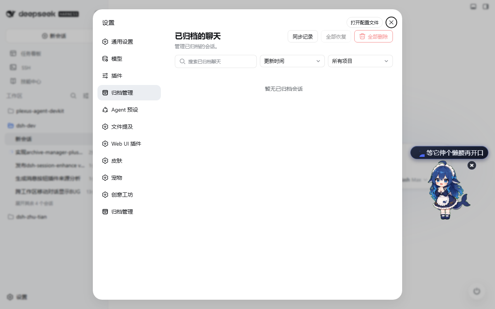
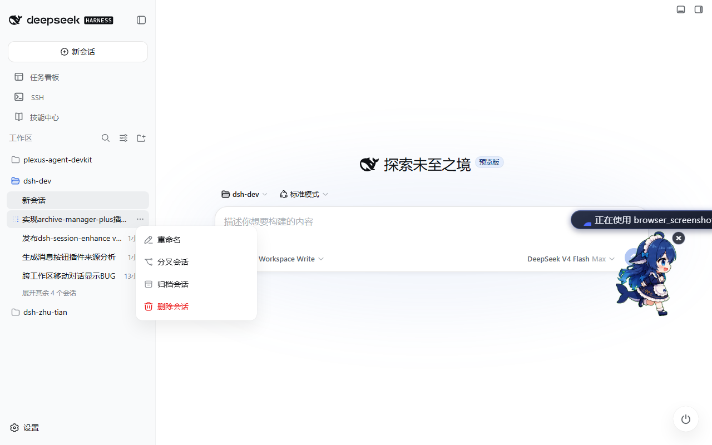

# 📦 DSH Session Enhance

**DeepSeek Harness Web 会话增强全能插件——归档、物理删除、拖拽跨工作区移动，让记录永远与磁盘真实一致；会话消息可编辑、可重试、可重新生成，每次改动都是可逆版本分支。**

   

[English](README.md)

---

社区插件，派生自 [@michengai/dsh-archive-manager](https://github.com/MichengAI/dsh-archive-manager)（Apache-2.0），打磨为**会话增强工具箱**，并合入 [dsh-message-edit](https://github.com/Moeblack/dsh-message-edit)（MIT）的消息编辑引擎：每个动作都是真实的文件系统操作，每次删除都可验证，`~/storages/*.json` 里的每条记录都保证与磁盘上的物理会话文件一致，每次对话编辑都是一条可逆分支。

## ✨ 亮点

| | 功能 | 你能得到什么 |
|---|---|---|
| 🗂️ | **归档管理** | 侧栏会话菜单一键归档；**设置 → 对话增强 → 归档管理** 统一管理：搜索、按时间/标题排序、按工作区筛选、取消归档、按项目/全部恢复、确认后批量删除。 |
| 🗑️ | **真实物理删除** | 真实删除转录目录（带重试，应对 Windows 句柄延迟释放），级联删除子代理、清理 spill，**并直接清扫 `~/storages/*.json`** 让幽灵记录无处藏身——删除后还会*验证*磁盘并告警残留。 |
| 🖱️ | **拖拽修改归属** | 侧栏把会话拖到另一个工作区分组（或「未分组」），**转录文件真实搬移到目标工作区目录**，工件 header 的 `cwd` 同步改写——只改记账导致会话从侧栏消失的隐患不复存在。 |
| 🔄 | **同步记录** | 一键按物理会话文件对账 `~/storages/*.json`：清理幽灵、修正归属、补记漏记。手动改文件/删文件后记录漂移？一键自愈。 |
| ✏️ | **消息编辑** | 会话 **Timeline** 视图：编辑任意用户/助手文本块、重试某个回合、重新生成最近一次回复——每次操作都分叉为**可逆版本分支**（截断或保留下游回合），完整版本树导航 + undo/redo。 |
| 📋 | **复制会话 ID** | 侧栏会话菜单一键 **复制ID**，把该对话的 session id 直接放进剪贴板——分享、排查、对账转录目录都更方便。 |
| ⚙️ | **设置升级** | 设置一级菜单改为 **对话增强**，内含两个二级页签：**基础设置**（可配置 `.dsh` 家目录，默认 `~/.dsh`，以及 **对话通知** 开关，默认开启）与 **归档管理**（沿用现有功能）。 |
| 🔔 | **对话通知** | 后台对话结束或需要你的操作（审批/提问/计划审阅）且你未聚焦于该对话时，弹出简单的系统提示——由 基础设置 里的 **对话通知** 开关控制。 |

## 📸 效果截图



在 **设置 → 对话增强 → 归档管理** 管理已归档会话：搜索、排序、按工作区筛选、**同步记录**、恢复与删除。



侧栏会话菜单一键归档。

## 📸 效果截图


在 **设置 → 对话增强 → 归档管理** 管理已归档会话：搜索、排序、按工作区筛选、**同步记录**、恢复与删除。


侧栏会话菜单一键归档。

## 🧩 为什么不用自带的归档功能？

| 能力 | 原生 DSH / 基础归档插件 | **dsh-session-enhance** |
|---|---|---|
| 归档 / 取消归档 / 批量恢复 | ✅ | ✅（同语义） |
| 删除时移除转录目录 | ⚠️ 单次 rm，无重试 | ✅ **3 次重试**（Windows 句柄释放） |
| 删除后 `~/storages/*.json` 一致性 | ⚠️ 依赖异步服务写链 | ✅ **直接磁盘清扫**：递归移除全部痕迹（`archivedSessionIds`、工作区 `sessionIds`、投影缓存行），原子 tmp+rename，无变化不写盘 |
| 删除后验证 | ❌ | ✅ `verifyDeleted` 远程方法 + 残留路径日志告警 |
| 拖拽到其他工作区 | ❌ 只改记账 → **会话从侧栏消失** | ✅ **文件一起搬**：转录目录迁移 + 工件 header `cwd` 改写（`node:zlib` zstd 帧布局感知），验证 + 失败自动回滚 |
| 防手动改/删文件 | ❌ | ✅ **同步记录**：清理幽灵、修正归属、补记漏记 |
| 防 stale list 复活已删会话 | ❌ | ✅ 删除墓碑 + 冷复用身份探针 |

## 🚀 安装

### 前置条件

- 可用的 DeepSeek Harness **Web** 环境（`dsh` 在 PATH，`web` profile 已初始化）
- Node.js `^22.19.0 || >=24.0.0`，pnpm

### 1️⃣ 从 GitHub（默认——始终最新提交）

```powershell
[Console]::OutputEncoding = [System.Text.Encoding]::UTF8
$OutputEncoding = [System.Text.Encoding]::UTF8
dsh plugin --profile web add github:Tinger-X/dsh-session-enhance
dsh --profile web --dump-config
```

直接从仓库安装，不经过 registry，始终是最新提交。

### 2️⃣ 从 npm（稳定版本）

```powershell
dsh plugin --profile web add dsh-session-enhance
dsh --profile web --dump-config
```

### 3️⃣ 从源码（开发 / 本地改动）

```powershell
git clone https://github.com/Tinger-X/dsh-session-enhance.git
Set-Location dsh-session-enhance
pnpm install
dsh plugin --profile web add .
dsh --profile web --dump-config
```

`dsh plugin add` 执行 pnpm add，并自动把声明了 `dsh.bundle.patch` 的依赖追加进 profile 的 `dsh.profile.bundles`。

> **验证**：`--dump-config` 应出现四行服务：
> `workspace-dsh-session-enhance`、`session-projection-cache-dsh-session-enhance`、`message-edit-dsh-session-enhance`、`ui-workspace-dsh-session-enhance`

重启 DSH Web 并强制刷新（Ctrl+F5）。设置中 **Connectors 之后**出现「对话增强」入口（专属归档盒图标），内含 **基础设置**（`.dsh` 家目录 + 对话通知开关）与 **归档管理** 两个页签；每个会话出现 **Timeline** 页签（紧随 **Trajectory** 之后）。

### ⚠️ 源码安装的 registry 说明

本仓库把所有 `@deepseek-ai/*` peer **精确钉版**（`0.1.1-rc.2`，与当前宿主一致），自带项目级 `.npmrc` 指向官方 registry，并用 `pnpm.overrides` 强制 `@deepseek-ai/dsh-invariants` → `0.1.1-rc.2`。

原因：范围解析可能拉到更新的 rc，其传递依赖引用了**不存在的** `dsh-invariants@^0.1.1`（任何 registry 都无法满足）；且 npmmirror 镜像的 `@deepseek-ai/*` 预发布元数据滞后。若 `pnpm install` 在 `@deepseek-ai` 包上失败，加 `--registry=https://registry.npmjs.org/` 重试。

## 🎮 使用

1. **归档** — 侧栏会话菜单 → *Archive session*。
2. **管理** — 设置 → **对话增强 → 归档管理**：搜索、排序（更新时间/创建时间/字母序）、按项目筛选、恢复、删除（一律确认）。
3. **同步记录** — 手动动过文件或 `storages/*.json` 之后点 **同步记录**：清理幽灵、修正错误归属、补记漏记、重建 header 索引；结果 toast 汇报 `扫描 / 补记 / 清理` 数量。
4. **拖拽移动** — 把会话行拖到另一个工作区分组头部（或其他分组的会话行上），或拖到 **未分组** 解除全部工作区归属：
   - 转录目录物理搬移，工件 header `cwd` 改写，变更落盘 `~/storages/workspace.json`。
   - 拖到「未分组」时文件留在原地（未分组没有目标路径）。
   - **正在运行**的会话会先 flush + detach（释放写路径与文件句柄），同时释放仍持有已脱离会话对象的旧 agent（否则后续消息会被写进脱离对象、静默丢失），之后重新打开即可。
   - 移动后立即改写投影缓存行的日志身份（`session_projcache.json` 的 cwd），标题/统计等投影继续从侧栏正常服务（不再回退显示目标工作区名直到重新打开）；`同步记录` 会一并修复此前已移动但身份陈旧的存量会话。
   - 移动成功后侧栏重拉会话基线，实时移动的会话立即出现在新工作区，无需刷新页面。
   - 若移动的是**当前打开的会话**：base 客户端会把该会话的常驻实例标记为 removed（输入框变「会话不可用」且刷新前不再复位），本插件会在移动后自动重新打开该会话并清除该标记（含 2 秒窗口内处理晚到的 `host/session-removed` 帧），输入框立即恢复可用，可继续对话。
   - 移动后会清理被带进目标目录的相反编码遗留工件（例如共享 `~/.dsh/sessions` 的另一 dsh 实例以不同编码写入的明文 `session.jsonl`；严格读取器会因此拒绝该会话并让 `session.list` 整体 500）。`同步记录` 也会清理这类文件并在结果中报告。
   - 同组内拖拽保持原有排序行为。
5. **删除** — 单条 / 按项目 / 全部删除，一律确认：
   `flush → detach → 记账清理 → 投影缓存行删除 → 子代理级联 → spill 清理 → 转录目录删除（重试）→ storages JSON 清扫 → 磁盘验证`
6. **编辑消息** — 打开会话，切到 **Timeline** 视图：
   - **编辑** — 点击任意用户/助手文本块替换内容，选择 *截断*（丢弃被编辑回合之后的一切）或 *保留*（重排队下游用户消息）。
   - **重试** — 用原始用户输入重跑某个回合。
   - **重新生成** — 重新生成最近一次助手回复（截断）。
   - 每次操作都打开一个**版本分支**；Timeline 列出全部版本（含父链、undo 栈、redo 目标）。用本插件删除派生分支不会破坏父会话的时间线。
7. **基础设置** — 设置 → **对话增强 → 基础设置**：配置 `.dsh` 家目录（插件据此定位 `storages` 目录，默认 `~/.dsh`）与 **对话通知** 开关（默认开启）。开启后，对话结束或需要用户操作时，若未聚焦于该对话会弹出系统提示。
8. **复制会话 ID** — 侧栏会话菜单 → *复制ID*，把该对话的 session id 复制到剪贴板（已归档会话同样可用）。

## 🏗 架构

```
lib/index.js          根宿主入口（ui-workspace-dsh-session-enhance）
lib/workspace.js      工作区注册表服务：归档语义、物理删除、moveSession（物理移动）、syncRecords
lib/projcache.js      投影缓存服务（墓碑守护写入）
lib/message-edit.js   消息编辑宿主行：回合原子版本分支（edit/retry/reroll）、
                      谱系时间线投影、/message-edit HTTP 路由（会话不存在返回 404）
lib/session-move.js   物理移动核心：转录目录迁移 + zstd 帧布局感知的工件 header.cwd 改写
                     （首帧校验、失败自动回滚）
lib/storage-sweep.js  ~/storages/*.json 直接磁盘清扫（递归痕迹移除、原子写、无变化不写）
lib/tombstone.js      通用 FIFO 墓碑簿记
lib/client.js         合并浏览器 bundle：侧栏菜单、对话增强设置页（基础设置 + 归档管理）、拖拽、导航图标、
                     Timeline 视图与会话头部控件（单一 loader 模块）
```

### HTTP 路由

| 端点 | 用途 |
|---|---|
| `GET /message-edit?sessionId=...` | 时间线投影（可编辑消息、可重试回合、版本树、undo/redo）；会话已删返回 `404`，投影冲突返回 `409` |
| `POST /message-edit` | 执行一次版本操作（`edit` / `retry` / `reroll`），返回新分支会话 id |

### 程序化 API（`workspaceRegistry` Typert Remotes）

| 方法 | 用途 |
|---|---|
| `archiveSession` / `unarchiveSession(sessionId)` | 归档（基类）/ 取消归档 |
| `unarchiveSessions(target)` | 全部 / 按工作区 / 未分组批量恢复 |
| `deleteSession(sessionId)` | **物理删除**：全痕迹清理 + 验证 |
| `deleteArchivedSessions(target)` | 批量删除，逐会话失败报告 |
| `moveSession(sessionId, targetWorkspaceId)` | 改归属 **并物理搬移文件**（`null` = 未分组） |
| `syncRecords()` | 按物理会话文件对账 storages |
| `verifyDeleted(sessionId)` | 删除后诊断（转录目录 + storages 残留） |
| `archivedSessionMetadata()` | 设置页排序所需的创建时间元数据 |
| `getSettings()` / `setSettings(settings)` | 读取 / 写入基础设置（`homeDir`、`notifyEnabled`），持久化到 `~/.dsh/session-enhance-settings.json` |

## 🛡 数据安全与完整性

- **删除一律二次确认**，且不可恢复。
- **实时会话先 flush 再清理**——不会截断转录，不会有打开句柄竞争。
- **处处原子写**：storages 清扫与工件 header 改写均 tmp + rename；移动会验证改写结果，失败**自动回滚**（原 header + 目录）。
- **墓碑机制**（FIFO，上限 4096）阻止 stale `list()` 复活已删会话；其他进程以同 id 重建新生命周期（`createdAt`/`cwd` 身份不同）时经冷复用探针撤除墓碑。
- **同步保守**：cwd 不可解析的会话不动；投影缓存幽灵行直接删除（不登记墓碑），文件日后恢复可正常重建。
- 会话至多归属一个工作区（防御重复记账）；归档状态与工作区归属正交——移动永不改变归档标记。

## 🧑‍💻 开发

```powershell
pnpm build    # 包结构校验
pnpm test     # node --test（storage-sweep + session-move + message-edit + merged-client 四套测试）
```

测试覆盖：

- `test/storage-sweep.test.mjs` — 递归痕迹移除、原子改写、非法/缺失文件容错、全目录清扫
- `test/session-move.test.mjs` — 迁移 + header 改写、真实后端 `readRaw` 形态（`{ meta, content }`）、幂等 no-op、**失败回滚且工件严格可读**、明文工件、无 raw 能力时响亮拒绝
- `test/message-edit.test.mjs` — 回合折叠、edit/retry/reroll 计划、请求体校验、种子与版本事件投影（含旧格式）
- `test/merged-client.test.mjs` — 合并 bundle 单一 loader 注册；两个半区 apply 均执行；inject 为并集；disposer 契约保留

客户端 bundle 由脚本生成：`node scripts/merge-client.mjs` 把 dsh-message-edit 的浏览器 bundle 内联进 `lib/client.js`（重新合并前先用 `git checkout -- lib/client.js` 恢复原始 bundle）。

## ⚙️ 兼容性

| 组件 | 版本 |
|---|---|
| DeepSeek Harness | `>=0.1.0-rc.5 <0.2.0`（开发基于 `0.1.1-rc.2`） |
| `@deepseek-ai/cordis` | `4.0.1` |
| Node.js | `^22.19.0 \|\| >=24.0.0`（依赖 `node:zlib` zstd） |
| 包管理器 | pnpm（仓库使用 `pnpm@11.21.0`） |

## ❓ FAQ

**它会动我的对话文件吗？**
只在删除、移动、同步时——且每步都原子、可验证、有日志。

**拖拽一个正在运行的会话会怎样？**
先 flush + detach（与删除一致），再物理移动；对话关闭后可在新工作区重新打开。

**移动能撤销吗？**
可以——拖回去即可。移动与记账本就幂等，重试安全。

**设置里我那个分区旁边是齿轮图标？**
设置壳按 section id 映射导航图标，未知 id 回退齿轮；本插件运行时替换为归档盒图标。

## 📄 License

Apache-2.0 —— 派生自 [@michengai/dsh-archive-manager](https://github.com/MichengAI/dsh-archive-manager)，保留其 LICENSE。

---

**为「数据就该躺在它该在的地方」的 DeepSeek Harness 用户而生。**
