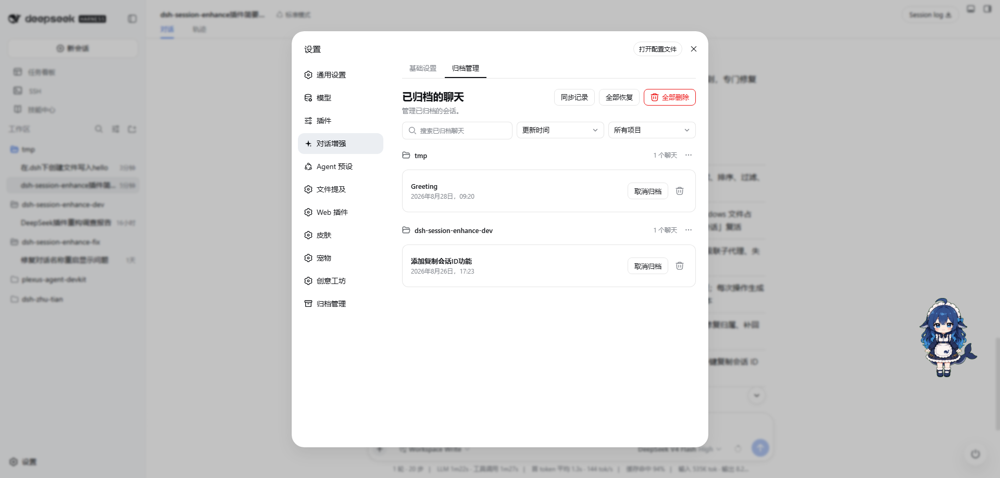
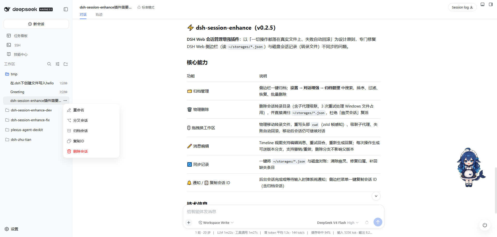
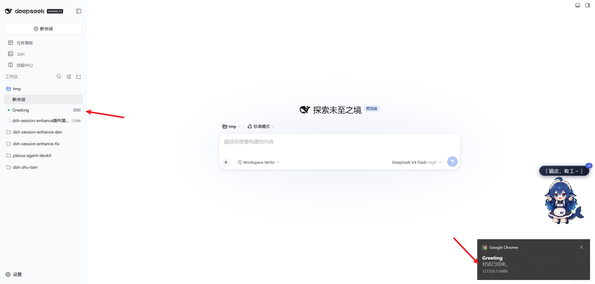
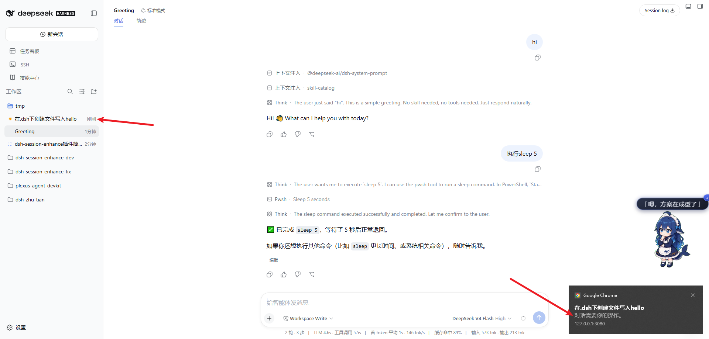

# ⚡ DSH Session Enhance

**带「回执」的会话管理。在 DeepSeek Harness Web 里归档、物理删除、跨工作区拖拽会话。每一步都真实落盘，侧栏永远与磁盘一致。**

   

[English](README.md)

---

## 它解决什么问题

DeepSeek Harness Web 在**两处**维护你的会话列表：侧栏读 `~/storages/*.json`，而真正的对话以转录文件形式躺在磁盘上。一旦两者漂移，就会出现：会话从侧栏消失、已删除的对话以幽灵之姿复活、标题显示成工作区名、移动后无法继续对话。

**DSH Session Enhance 弥合这道裂缝。** 每一次操作都是真实的文件系统改动——磁盘校验、失败回滚——侧栏与文件对不上账成为历史。

## 痛点 → 修复

| 你遇到 | 它这么做 |
|---|---|
| 删除后会话「复活」成幽灵 | 真实删除转录目录（3 次重试应对 Windows 句柄释放）、直接清扫 `~/storages/*.json`、删除后校验并告警残留；墓碑机制阻断 stale 列表复活。 |
| 拖拽后会话从侧栏消失 | 文件真实搬移：转录 header `cwd` 改写（zstd 帧感知）、校验、失败自动回滚；级联子代理、投影缓存 rehome 保住标题。 |
| 重启后标题显示成工作区名 | 启动时按物理 header 对齐投影身份，后台预热无缓存标题。 |
| 移动后无法继续对话 | 运行中会话先 flush + detach、释放持有旧会话的 agent、当前打开的会话自动重开。 |
| 手动改/删文件后记录漂移 | **同步记录** 一键按磁盘文件对账 `~/storages/*.json`：清幽灵、修归属、补漏记。 |
| `session.list` 500 | 清理相反编码遗留工件（另一实例写下的明文/zstd 双写），移动与同步时都会处理。 |

## ✨ 更多能力

- 🗂️ **归档管理** — 侧栏菜单一键归档；**设置 → 对话增强 → 归档管理** 里搜索、排序、筛选、恢复、批量删除。
- 🔔 **对话通知** — 后台对话结束或需要你操作时弹出系统提示。
- 📋 **复制会话 ID** — 侧栏菜单一键复制，已归档会话同样可用。
- ⚙️ **对话增强设置** — **设置 → 对话增强 → 基础设置** 配置 `.dsh` 家目录与通知开关。

## 📸 效果截图


在 **设置 → 对话增强 → 基础设置** 的一些设置。



在 **设置 → 对话增强 → 归档管理** 管理已归档会话：搜索、排序、按工作区筛选、**同步记录**、恢复与删除。



侧栏中的会话菜单。



当你不在对话界面时，会话结束通知。



当你不在对话界面时，会话操作通知。

## 🚀 安装

需要可用的 DeepSeek Harness **Web** 环境（`dsh` 在 PATH、`web` profile 已初始化）以及 Node.js `^22.19.0 || >=24.0.0`。

```powershell
# 从 GitHub（最新提交）
dsh plugin --profile web add github:Tinger-X/dsh-session-enhance

# 从 npm（稳定版本）
dsh plugin --profile web add dsh-session-enhance

# 从源码（开发）
git clone https://github.com/Tinger-X/dsh-session-enhance.git
cd dsh-session-enhance; pnpm install
dsh plugin --profile web add .

dsh --profile web --dump-config
```

重启 DSH Web 并强制刷新（Ctrl+F5）。设置中 **Connectors 之后**出现「对话增强」入口。

## 🎮 快速上手

- **归档** — 侧栏会话菜单 → *Archive session*。
- **管理** — 设置 → 对话增强 → 归档管理：搜索、排序、筛选、恢复、批量删除。
- **同步** — 手动动过文件或 `storages/*.json` 后点 **同步记录**。
- **移动** — 把会话行拖到另一个工作区分组。
- **删除** — 单条 / 按项目 / 全部，一律确认。
- **复制** — 侧栏菜单一键复制。
- **通知** — 后台对话结束或需要你操作时弹出系统提示。

## 📄 License

Apache-2.0。
