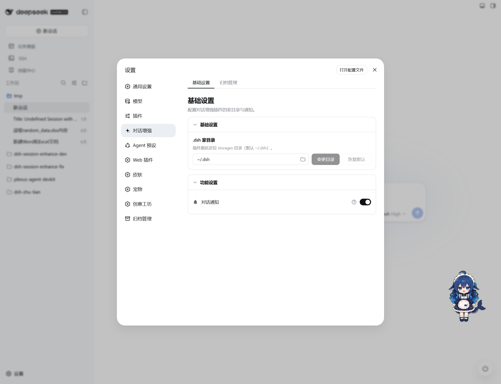
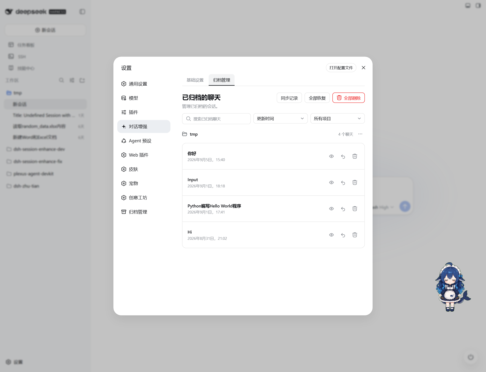
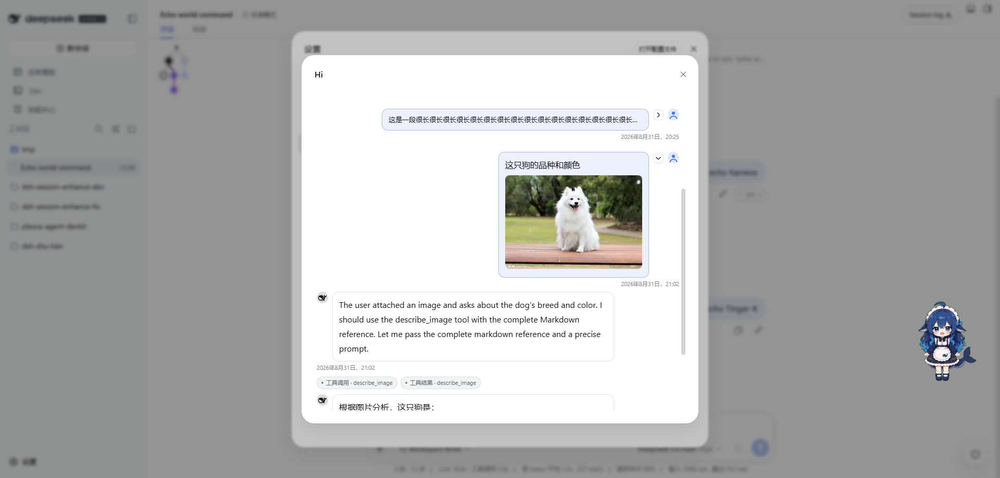
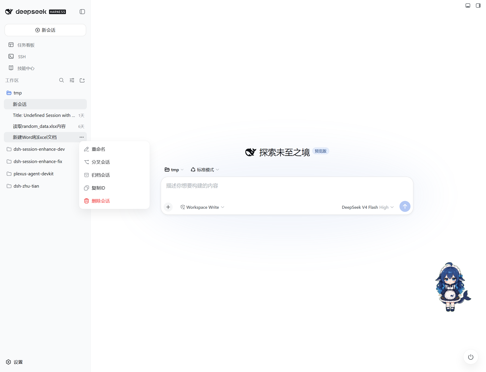
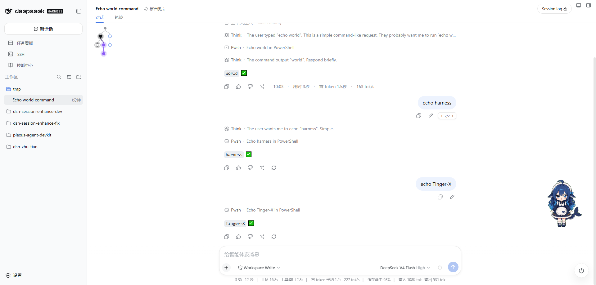
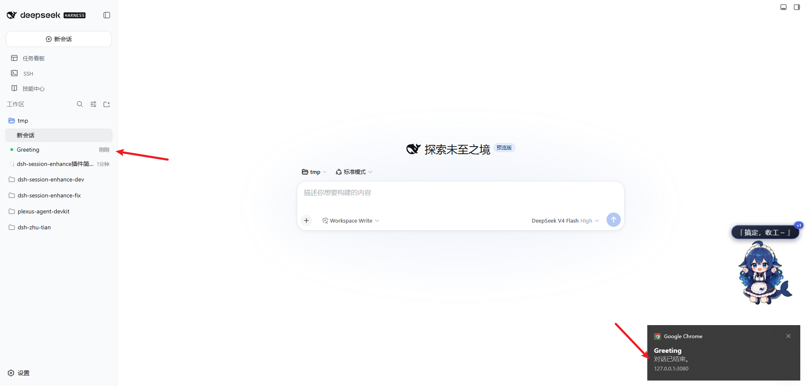
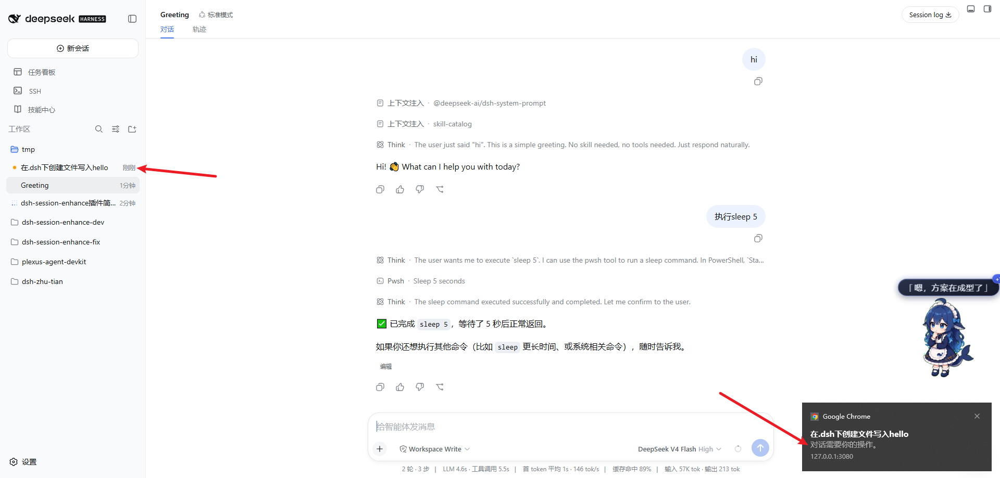

# ⚡ DSH Session Enhance

**面向 DeepSeek Harness Web 的对话增强插件。** 让会话管理真正像工具而非一摞 JSON 文件：归档与恢复对话、保证物理删除、跨工作区拖拽会话、把任意对话变成可自由切换分支的树，以及后台对话需要你时第一时间通知你。

   

[English](README.md)

---

## 这是什么

`dsh-session-enhance` 是针对 **DeepSeek Harness（DSH）Web** 的对话增强插件，致力于让每一次对话都更易于查找、整理、清理与回访——少花时间折腾会话列表，多花时间对话。

它的核心思路是把会话列表当成**磁盘文件之上的一个视图**，而不是独立的权威：下面每一项操作都是真实、经过校验的文件系统变更——失败自动回滚——侧栏与转录文件从此不会再悄悄对不上账。删除对话会真正抹掉它的文件；把对话拖到另一个工作区会真的搬移它的转录；在同一个对话里切换分支时，任何一条旧回复都不会丢失。

## 功能特性

### 🗂️ 归档与恢复
在会话菜单里一键归档任意对话；归档行带有清晰标记、不再打扰你，需要时一键恢复。归档状态与工作区归属正交，因此已归档的对话会保留原来的位置。

- 会话菜单逐条 **归档 / 恢复**。
- **归档管理**（设置 → 对话增强 → 归档管理）：搜索、按最近更新 / 创建时间 / 名称排序、按项目筛选、单条恢复、批量恢复（全部 / 按项目 / 未分组）。
- **预览对话** —— 只读打开任意已归档对话：按回合呈现用户 / 助手 / 系统消息，工具调用与结果、Markdown、内联图片都正常显示。

### 🗑️ 保证物理删除
“删除”就是真的删除。插件会移除一切，然后再证明给你看：

- 先 flush + detach 正在运行的会话，释放仍持有它的 agent。
- 删除转录目录（带重试以应对 Windows 句柄延迟释放），并级联删除其子代理会话。
- 把该会话的痕迹从 `~/storages/*.json`、投影缓存、归档集合与各工作区记录里逐一清扫。
- 删除后**校验**磁盘上无任何残留；若有残留会明确告诉你。
- 为已删除 id 打**墓碑**，杜绝 stale 会话列表把幽灵复活；同 id 的全新对话仍能被正确识别。

删除确认弹窗会写清楚将失去什么（对话内容、子代理含正在运行的、各类缓存）。可删除单条，也可批量删除全部已归档对话——全部、某个项目或未分组集合。

### 📦 跨工作区移动 —— 直接拖拽
把会话行拖到另一个工作区分组，它的转录会**物理搬移**到该项目的文件夹。会话文件内的 `cwd` 头部会被改写（zstd 感知：头部独占第一帧、布局经过校验、失败自动回滚），投影缓存 rehome 以保住标题，陈旧 agent 被释放。拖走的若正是当前打开的对话，它会自动重开并立即可用。拖到“未分组”则只是解除归属。在同一工作区内拖动会话行还可以调整顺序。

### 🔔 对话通知
发起一个对话然后切走——当它在后台**结束**或**需要你操作**（等待审批、计划待审、等待回答）时，只要页面未聚焦就会弹出系统提示。可在基础设置里开关。

### 📋 复制会话 ID
会话菜单一键复制，已归档会话同样适用。

### 🌳 对话树
每一段对话都是一棵**树**，而不是一条线。你的每一轮提问是一个节点；任何时候重生成或修改回答，都会长出**新分支**——旧回复被完整保留而非丢弃，随时可以切回去。

- 对话视图左侧绘制一棵树的概览：按分支着色的圆点（每个点对应一轮提问）与连线；悬浮圆点可查看该轮内容，点击可跳转到该轮。
- **重新生成** —— 在任意已完成回答下方的“重新生成”按钮，从那一轮回退并重新生成。
- **修改并重新生成** —— 打开你之前任意一条消息、改写后让 DSH 从新表述继续。
- **切换分支** —— 在分叉点用 `‹ n/m ›` 控件在同一对话的不同续写间来回切换。
- 安全设计：若某个更深的分支会被危险改写，插件会拒绝执行（并隐藏按钮），绝不产生悬空或丢失内容；回答仍在流式生成时发出的分支操作会排队，结束后自动重放。

### 🔁 记录同步与自愈
会话索引可能因手动改文件或另一个 DSH 实例写盘而漂移：

- **同步记录** 以真实转录为权威对账记账：清理幽灵记录、把记错项目的会话移回真实项目、补录遗漏会话、清理投影缓存幽灵行并 rehome 身份。
- 启动时自动把被移动会话的缓存身份与物理头部对齐，标题不会在重启后退化成工作区名。

### 🧹 工作区与磁盘卫生
- 在侧栏管理工作区：选择已存在文件夹创建工作区、重命名、删除（其会话回落到“未分组”，文件保留），以及在工作区内新建会话。
- 在归档管理中删除某个项目，会一并删除该项目全部已归档对话，项目文件夹清空后也会被移除。
- 磁盘上残留的空工作区目录会被列出并可删除。

### ⚙️ 设置
**设置 → 对话增强** 有两个页签：
- **基础设置** —— `.dsh` 家目录（插件据此定位 `storages` / `sessions` / `attachments`，默认 `~/.dsh`，可手动选目录或恢复默认）与 **对话通知** 开关。
- **归档管理** —— 即上文归档相关的全部能力。

## 效果截图



设置 → 对话增强 → 基础设置。



在 设置 → 对话增强 → 归档管理 管理已归档对话：搜索、排序、按项目筛选、同步记录、恢复与删除。



在 设置 → 对话增强 → 归档管理 中预览已归档的对话。



工作区侧栏里的会话操作（归档、复制 ID、删除等）。



有分支会话的对话树：左侧轨道上每一轮提问是一个按分支着色的节点；已完成的回答可“重新生成”，历史提问可“修改并重新生成”；在分叉点用 `‹ n/m ›` 在同一对话的不同续写间切换。



后台对话结束时的系统提示。



后台对话需要你操作时的系统提示。

## 安装

需要可用的 DeepSeek Harness **Web** 环境（`dsh` 在 PATH、`web` profile 已初始化）以及 Node.js `^22.19.0 || >=24.0.0`。

```powershell
# 从 GitHub（最新提交）
dsh plugin --profile web add github:Tinger-X/dsh-session-enhance

# 从 npm（稳定版本）
dsh plugin --profile web add dsh-session-enhance

# 从源码（开发）
git clone https://github.com/Tinger-X/dsh-session-enhance.git
cd dsh-session-enhance; pnpm install
dsh plugin --profile web add .

dsh --profile web --dump-config
```

重启 DSH Web 并强制刷新（Ctrl+F5）。设置中会出现「对话增强」入口。

> 对话树功能跟随开发分支推进。如果你安装的是 npm 稳定版却看不到对话树，请用上方的最新提交方式更新。

## 快速上手

- **浏览** —— 搜索、按工作区（或单列）分组、按最近 / 手动排序，行上直接看会话状态。
- **归档** —— 会话菜单 → *Archive*；稍后在 设置 → 对话增强 → 归档管理 里打理。
- **预览** —— 已归档聊天行上的眼睛图标。
- **删除** —— 会话菜单 → *Delete session*（一律确认）。批量：归档管理 → 分组的 *Delete all*。
- **移动** —— 把会话行拖到另一个工作区；在工作区内拖动可调整顺序。
- **复制 ID** —— 会话菜单 → *Copy ID*。
- **通知** —— 发起对话后切到别处。
- **分支** —— 打开对话：用回答下的“重新生成”或你消息上的编辑按钮来长出分支，在分叉点用 `‹ ›` 切换分支。

## 路线图

规划中 / 开发中的想法，不分先后：

- 打开工作区目录。
- 定时归档 —— 自动归档长期不活跃的对话。
- 在工作区会话列表中直接批量归档、批量删除。
- 对话星标 —— 将对话标星、排在工作区最前，且不参与自动归档。
- 对话分享 —— 导出 / 导入整棵对话树（`.dshse-share`），导入后可继续对话。
- 删除单个对话节点 / 分支。
- 对话树控制的深化、性能与稳定性。
- 对话内容回退（回退到对话中途，并一并回退当时改动的文件）。
- 其它让对话更顺手的相关功能。

## License

Apache-2.0。
